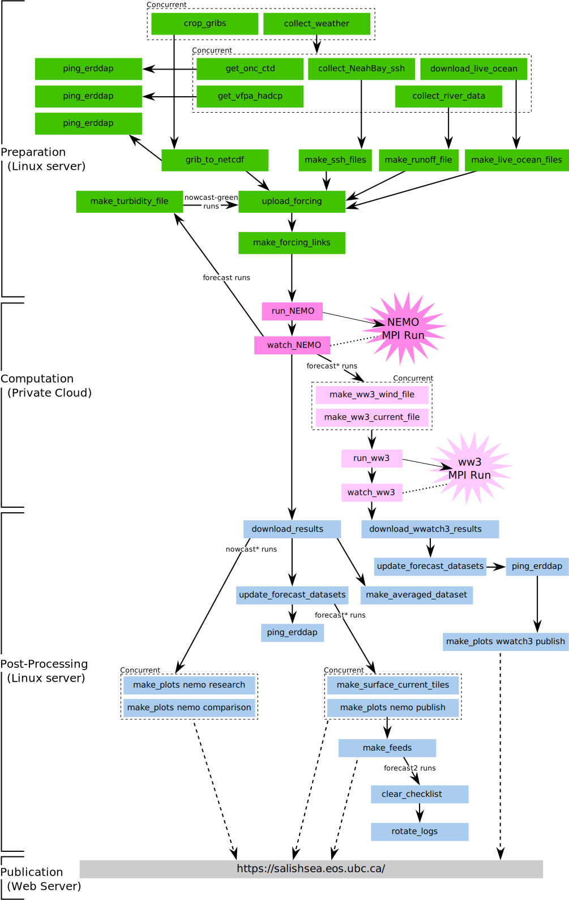

.. Copyright 2013-2016 The Salish Sea MEOPAR contributors
.. and The University of British Columbia
..
.. Licensed under the Apache License, Version 2.0 (the "License");
.. you may not use this file except in compliance with the License.
.. You may obtain a copy of the License at
..
..    http://www.apache.org/licenses/LICENSE-2.0
..
.. Unless required by applicable law or agreed to in writing, software
.. distributed under the License is distributed on an "AS IS" BASIS,
.. WITHOUT WARRANTIES OR CONDITIONS OF ANY KIND, either express or implied.
.. See the License for the specific language governing permissions and
.. limitations under the License.

****************************
The Nowcast System Framework
****************************

The Salish Sea Nowcast System is a fully automated software system that runs the Salish Sea NEMO model several times each day to produce nowcast and forecast run results.
The runs use the most up-to-date available forcing data and model products:

* atmospheric forcing from the Environment Canada HRDPS
  (High Resolution Deterministic Prediction System) 2.5 km resolution model
* daily average discharge of the Fraser River from the Environment Canada river gauge at Hope
* sea surface height on the western open boundary from the NOAA storm surge forecast model and tide gauge at Neah Bay, WA

Daily nowcast and forecast runs have been produced since mid-October 2014.

* Summary information from the run results is presented on the https://salishsea.eos.ubc.ca/nemo/results/ page.
* The full collection of results files from each run are stored on the :ref:`SalishSeaModelResultsServer`.
* The nowcast results datasets are publicly available on our ERDDAP server at https://salishsea.eos.ubc.ca/erddap/info/

Presently there are 4 runs each day:

* 24h of physics model time for today (:kbd:`nowcast`)
* 24h of green ocean model time for today  (:kbd:`nowcast-green`)
* 30h of physics model time for tomorrow (:kbd:`forecast`)
* 30h of physics model time for the next day (:kbd:`forecast2`)

The :kbd:`nowcast`,
:kbd:`forecast`,
and :kbd:`forecast2` runs use the NEMO-3.4 :kbd:`SalishSea` configuration.

The :kbd:`nowcast-green` runs use the NEMO-3.6 :kbd:`SOG` (aka :kbd:`SMELT`) configuration.
In addition to being a test-bed for the in-development biogeochemical components of the model,
the :kbd:`nowcast-green` runs are a test-bed for improvements to the physics model as we move toward the next iteration of the nowcast system's NEMO model.

Software Architecture
=====================

The :py:obj:`SalishSeaNowcast` package holds the Python modules that power the nowcast system.
The system workflow looks like:

Each box in the figure above is a :ref:`NowcastSystemWorker`,
a Python process that is launched by the system to do a particular job and terminate when that job is finished.
The workers are defined in Python modules in the :py:obj:`nowcast.workers` namespace.

The workers are
(almost all)
launched and coordinated by the :ref:`NowcastSystemManager`,
:py:mod:`nowcast.nowcast_mgr`.
Unlike the workers that come and go as needed to do their jobs,
the manager is a long-running Python process that is only stopped and restarted when the system configuration needs to be changed.

After the manager launches a worker they communicate with each other using a messaging system based on the `ZeroMQ`_ distributed messaging framework.

.. _ZeroMQ: http://zeromq.org/

Before we get into the details of the :ref:`NowcastMessagingSystem`,
it is important to mention one more piece of the architecture:
the :ref:`NowcastMessageBroker`,
:py:mod:`nowcast.nowcast_broker`.
The message broker is also a long-running Python process that is almost never stopped and restarted.
It buffers and relays messages between the workers and the manager so that both the workers and the manager can start,
stop,
or restart without affecting one another.

.. _NowcastMessagingSystem:

Nowcast Messaging System
========================

Inside the code of a worker and the nowcast manager,
a nowcast message is a Python dictionary:

.. code-block:: python

    message = {
        'source': 'download_weather',
        'msg_type': 'success 12',
        'payload': {'12 forecast': True},
    }

The value associated with the :kbd:`source` key is the name of process that is sending the message;
i.e. the worker name,
or :kbd:`nowcast_mgr`.

The :kbd:`msg_type` value is a key associated with the message sender in the message registry section of the :ref:`NowcastConfigFile`.
For example,
the message registry entries for the :py:mod:`~nowcast.workers.download_weather` worker is:

.. code-block:: yaml

    msg_types:
      ...
      download_weather:
        success 00: 00 weather forecast ready
        failure 00: 00 weather forecast download failed
        success 06: 06 weather forecast ready
        failure 06: 06 weather forecast download failed
        success 12: 12 weather forecast ready
        failure 12: 12 weather forecast download failed
        success 18: 18 weather forecast ready
        failure 18: 18 weather forecast download failed
        crash: download_weather worker crashed
      ...

The message :kbd:`payload` value can be any Python object
(including :py:obj:`None`)
that can be a value in a dictionary.
The payload value is inserted into a :kbd:`checklist` dictionary that the nowcast manager uses to maintain information about the state of the nowcast system.
Message payloads vary markedly from one worker to another depending on what information a worker needs to convey to the manager,
other workers,
or nowcast system users inspecting the system state.

Message exchanges are always initiated by workers.
Workers send a message to the manager when they have something significant to report:

* Successful completion of their task
* Failure to complete their task
* Crashing due to an unhandled exception
* Needing information from the manager about the state of the nowcast system
* Providing a message to be included in the nowcast system logging output
  (only from workers running on remote hosts)

When the manager receives a message from a worker it acknowledges the message with one of two types of return message.
Those messages are also defined in the message registry section of the :ref:`NowcastConfigFile`:

.. code-block:: yaml

    msg_types:
      ...
      nowcast_mgr:
        ack: message acknowledged
        undefined msg: ERROR - message type is not defined
      ...

So,
an "all is good" acknowledgment message from the manager in response to a message from a worker might look like:

.. code-block:: python

    message = {
        'source': 'nowcast_mgr',
        'msg_type': 'ack',
        'payload': None,
    }

Before messages can be passed among a worker,
the :ref:`NowcastMessageBroker`,
and the :ref:`NowcastSystemManager` they must be transformed into strings for transmission across the network.
That is done by transforming the Python dictionary object into a `YAML document`_,
a process that is known as "serialization".
The message recipient transforms the YAML document back into a Python dictionary
("deserialization").

.. _YAML document: http://pyyaml.org/wiki/PyYAMLDocumentation#YAMLsyntax

Deserialization is done using the :py:func:`yaml.safe_load()` function.
That function limits the types of Python objects that can be in a message to
(more or less)
the Python data
(:py:obj:`True`,
:py:obj:`False`,
:py:obj:`None`,
:py:obj:`float`,
:py:obj:`int`,
etc.)
and data container objects
(:py:obj:`dict`,
:py:obj:`list`,
:py:obj:`tuple`,
etc.).
Doing so is a security measure to prevent the possibility of injection into the system of a maliciously crafted message that could execute arbitrary code on the nowcast system server.

Messages are transmitted among the workers,
broker,
and the manager on the TCP network layer using dedicated ports.

* When the broker is started it binds to a "front-end" port to listen for messages from workers,
  and a "back-end" port to listen for messages from the manager.
  After that,
  the broker simply listens for messages and queues them in both directions between the front-end and back-end ports.
  It does not deserialize the YAML documents,
  it just passes them along.

* When the manager is started it connects to the back-end port and listens for messages.
  When it receives a message it deserializes it,
  handles it,
  and send the appropriate acknowledgment message back.

* When a worker is started it connects to the front-end port.
  When it has something to report to the manager it serializes the message,
  sends it,
  and waits for an acknowledgment from the manager.

The server on which the broker is running,
and the front-end and back-end port numbers that the system uses are defined in the :ref:`NowcastConfigFile`.

The nowcast messaging system is based on the `ZeroMQ`_ distributed messaging framework.
You probably don't need to delve into the details of ZeroMQ,
but it is important to note that this is one of the situations where the nowcast system "stands on the shoulders of giants" rather than "re-inventing the wheel".

.. _NowcastMessageBroker:

Nowcast Message Broker
======================

.. _NowcastSystemManager:

Nowcast System Manager
======================

.. _NowcastSystemWorker:

Nowcast System Worker
=====================
