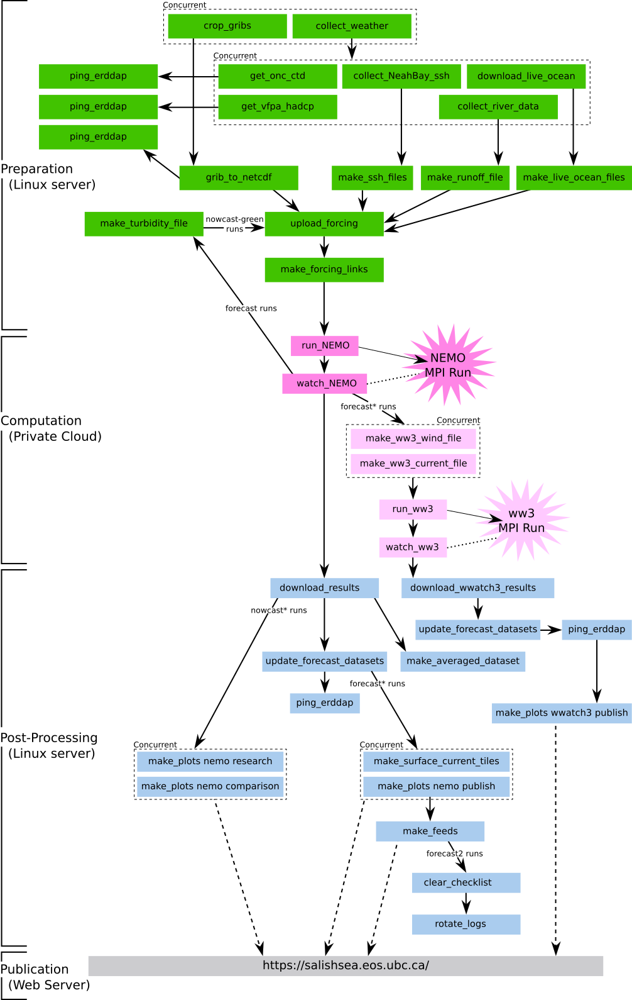

..  Copyright 2013 – present by the SalishSeaCast Project contributors
..  and The University of British Columbia
..
..  Licensed under the Apache License, Version 2.0 (the "License");
..  you may not use this file except in compliance with the License.
..  You may obtain a copy of the License at
..
..     https://www.apache.org/licenses/LICENSE-2.0
..
..  Unless required by applicable law or agreed to in writing, software
..  distributed under the License is distributed on an "AS IS" BASIS,
..  WITHOUT WARRANTIES OR CONDITIONS OF ANY KIND, either express or implied.
..  See the License for the specific language governing permissions and
..  limitations under the License.

.. SPDX-License-Identifier: Apache-2.0

.. _SalishSeaNowcastSystem:

*******************************************
SalishSeaCast OCean Model Automation System
*******************************************

The Salish Sea Nowcast system is a software automation system that runs the
`SalishSeaCast ocean models`_ in a daily nowcast/forecast mode.
The runs use as-recent-as-available
(typically previous day)
forcing data for the western boundary sea surface height and the Fraser River flow,
and atmospheric forcing from the four-times-daily produced forecast product from the
Environment and Climate Change Canada `High Resolution Deterministic Prediction System (HRDPS)`_
operational GEM 2.5km resolution model.

.. _SalishSeaCast ocean models: https://salishsea.eos.ubc.ca/nemo/
.. _High Resolution Deterministic Prediction System (HRDPS): https://weather.gc.ca/grib/grib2_HRDPS_HR_e.html

The runs are automated using an asynchronous,
distributed,
message-based architecture provided by the `NEMO_Nowcast`_ framework package.
`SalishSeaNowcast`_ is the Python package that uses the `NEMO_Nowcast`_ framework to implement the Salish Sea Nowcast system.

.. _NEMO_Nowcast: https://nemo-nowcast.readthedocs.io/en/latest/
.. _SalishSeaNowcast: https://github.com/SalishSeaCast/SalishSeaNowcast

The automation system:

* obtains the forcing datasets from web services
* pre-processes the forcing datasets into the formats expected by NEMO
* uploads the forcing dataset files to the HPC or cloud-computing facility where the run will be executed
* executes the run
* downloads the results
* prepares a collection of plots from the run results for monitoring purposes
* publishes the plots and the processing log to the web

Results of the model runs can be found on the `SalishSeaCast model results site`_ and on the project's `ERDDAP server`_.

.. _SalishSeaCast model results site: https://salishsea.eos.ubc.ca/nemo/results/
.. _ERDDAP server: https://salishsea.eos.ubc.ca/erddap/index.html

The system is deployed on a server maintained by the UBC Dept. of Earth, Ocean and Atmospheric Sciences.
Computing resources to run the NEMO model are provided by `Ocean Networks Canada`_ (cloud) and `Westgrid`_ (HPC).

.. _Ocean Networks Canada: https://www.oceannetworks.ca/
.. _Westgrid: https://www.westgrid.ca/

The system consists of long-running message broker,
log aggregator,
and manager processes.
A collection of worker processes are launched by the manager to do particular jobs and terminate when that job is finished.
Please see :ref:`nemonowcast:FrameworkArchitecture` for a description of the system architecture.
The workers are implemented in Python modules in the :ref:`nowcast.workers <SalishSeaNowcastSystemWorkers>` and :ref:`nemo_nowcast.workers <nemonowcast:NEMO_NowcastBuiltinWorkers>` namespaces.

Process Flow
============

The system workflow looks like:

    Work flow of preparation for and execution of the daily runs.

The green boxes in the figure above are :ref:`SalishSeaNowcastSystemWorkers`.

Contents
========

.. toctree::
   :maxdepth: 2

   workers
   creating_workers
   figures/index
   deployment/index
   config
   worker_failures
   pkg_development

Indices and Tables
------------------

* :ref:`genindex`
* :ref:`modindex`

License
=======

The SalishSeaCast NEMO model nowcast system code and documentation are copyright 2013 – present
by the `SalishSeaCast Project Contributors`_ and The University of British Columbia.

.. _SalishSeaCast Project Contributors: https://github.com/SalishSeaCast/docs/blob/master/CONTRIBUTORS.rst

They are licensed under the Apache License, Version 2.0.
http://www.apache.org/licenses/LICENSE-2.0
Please see the LICENSE file for details of the license.
