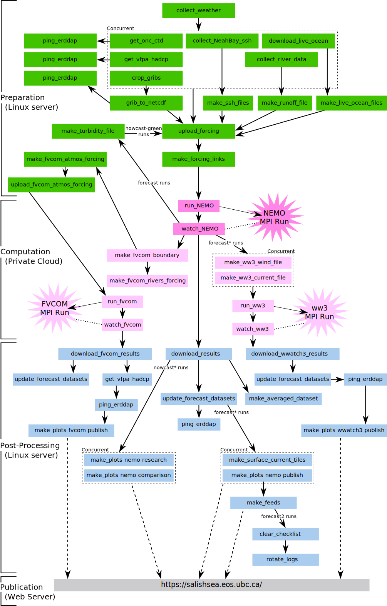

.. Copyright 2013-2016 The Salish Sea MEOPAR contributors
.. and The University of British Columbia
..
.. Licensed under the Apache License, Version 2.0 (the "License");
.. you may not use this file except in compliance with the License.
.. You may obtain a copy of the License at
..
..    http://www.apache.org/licenses/LICENSE-2.0
..
.. Unless required by applicable law or agreed to in writing, software
.. distributed under the License is distributed on an "AS IS" BASIS,
.. WITHOUT WARRANTIES OR CONDITIONS OF ANY KIND, either express or implied.
.. See the License for the specific language governing permissions and
.. limitations under the License.

.. _SalishSeaNowcastSystemWorkers:

*********************************
Salish Sea Nowcast System Workers
*********************************

Process Flow
============

    Work flow of preparation for and execution of the daily runs.

The green,
pink,
and blue boxes in the figure above are the workers described below.

The :ref:`nemonowcast:Scheduler` is a long-running process that periodically checks the system clock and launches workers when their scheduled time to run is reached.
It is,
however,
only used to launch the :py:mod:`nowcast.workers.download_weather` worker.

The other workers are launched and coordinated by the :ref:`nemonowcast:SystemManager`,
another long-running process that keeps track of the state of the nowcast system.
The workers and manager communicate by using the :ref:`nemonowcast:MessagingSystem` to pass messages back and forth.

The messages are mediated by the :ref:`nemonowcast:MessageBroker`,
a third long-running process that queues messages in both directions between the manager and the workers.
That queuing improves the robustness of the system.

Please see :ref:`nemonowcast:FrameworkArchitecture` for a more detailed description of the system architecture.

The process flow in the diagram above is somewhat idealized.
For example:

* The :py:mod:`~nowcast.workers.download_weather` worker is launched four times daily,
  to get the hour 00, 06, 12, and 18 UTC forecast products.
* The :py:mod:`~nowcast.workers.make_runoff_file` worker is only launched after the 06 forecast download finishes because the river runoff forcing is based on daily average discharge values and climatology.
* The :py:mod:`~nowcast.workers.grib_to_netcdf` worker is only launched after the 06 and 12 forecast downloads finish to prepare the atmospheric forcing files that will be used by the preliminary forecast run,
  and the nowcast and updated forecast runs.
  However,
  :py:mod:`~nowcast.workers.grib_to_netcdf` uses results from several preceding forecast products downloads to do its job.
* Etc.

To fully understand the flow and interactions of workers,
please read the code in the :py:mod:`nowcast.next_workers` module.

Workers
=======

.. _DownloadWeatherWorker:

:kbd:`download_weather`
-----------------------

.. automodule:: nowcast.workers.download_weather
    :members: main

:kbd:`make_runoff_file`
-----------------------

.. automodule:: nowcast.workers.make_runoff_file
    :members: main

.. _GetNeahBaySshWorker:

:kbd:`get_NeahBay_ssh`
----------------------

.. automodule:: nowcast.workers.get_NeahBay_ssh
    :members: main

:kbd:`grib_to_netcdf`
---------------------

.. automodule:: nowcast.workers.grib_to_netcdf
    :members: main

:kbd:`download_live_ocean`
--------------------------

.. automodule:: nowcast.workers.download_live_ocean
:members: main

:kbd:`upload_forcing`
---------------------

.. automodule:: nowcast.workers.upload_forcing
    :members: main

:kbd:`make_forcing_links`
-------------------------

.. automodule:: nowcast.workers.make_forcing_links
    :members: main

:kbd:`run_NEMO`
---------------

.. automodule:: nowcast.workers.run_NEMO
    :members: main

.. _WatchNEMO-Worker:

:kbd:`watch_NEMO`
-----------------

.. automodule:: nowcast.workers.watch_NEMO
    :members: main

:kbd:`download_results`
-----------------------

.. automodule:: nowcast.workers.download_results
    :members: main

:kbd:`get_onc_ctd`
------------------

.. automodule:: nowcast.workers.get_onc_ctd
    :members: main

:kbd:`ping_erddap`
------------------

.. automodule:: nowcast.workers.ping_erddap
    :members: main

:kbd:`make_plots`
-----------------

.. automodule:: nowcast.workers.make_plots
    :members: main

:kbd:`make_feeds`
-----------------

.. automodule:: nowcast.workers.make_feeds
    :members: main

:kbd:`clear_checklist`
----------------------

.. automodule:: nemo_nowcast.workers.clear_checklist
    :members: main

:kbd:`rotate_logs`
------------------

.. automodule:: nemo_nowcast.workers.rotate_logs
    :members: main

Worker Utility Functions
------------------------

:py:mod:`nowcast.lib` Module
^^^^^^^^^^^^^^^^^^^^^^^^^^^^

.. automodule:: nowcast.lib
    :members:

:kbd:`next_workers` Module
==========================

.. automodule:: nowcast.next_workers
    :members:
